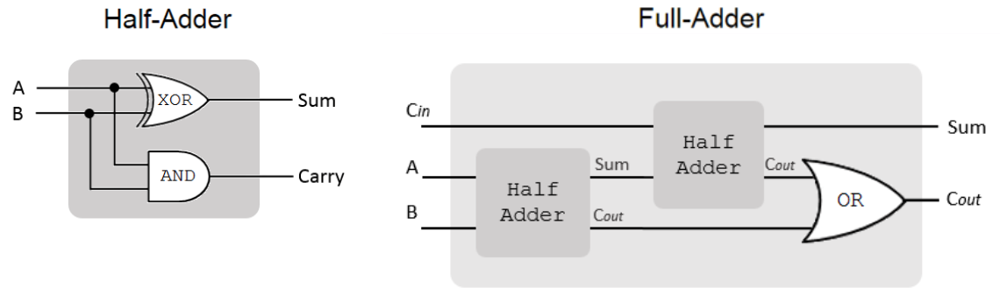
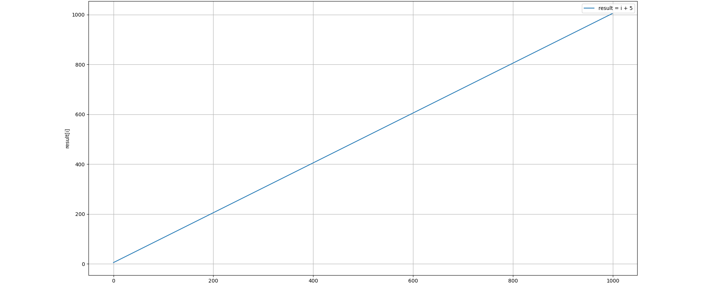
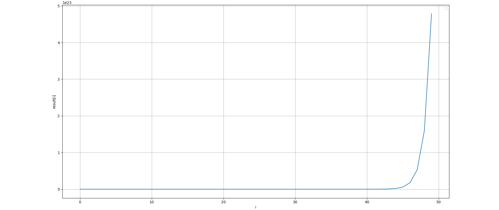
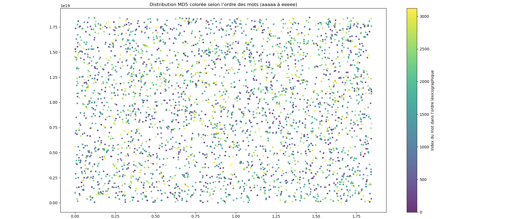
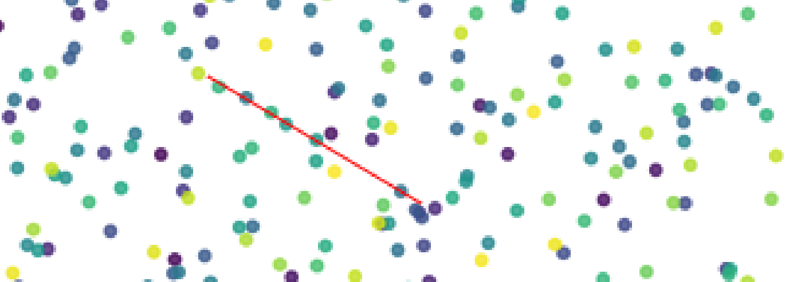

```
🤖 L'IA a été utilisée pour faciliter la collecte d'informations et expliquer 
des concepts mathématiques présentés de manière très abrupte dans les articles
de recherche sur le sujet. Cependant, l'ensemble du contenu et des calculs ont 
été rédigés par un humain (sauf mention contraire).

Cet article a pour but de présenter et d'expliquer de façon accessible un sujet 
aussi complexe que l'iO sans pour autant faire de concessions avec la réalité du sujet. 
Si une erreur est présente dans cette papier merci de m'en faire part.
```

# L'obfuscation indistinguable (iO)

L'objectif est de pouvoir rendre le code publique mais mathématiquement impossible à reverse. Ce type de méthode pourrait permettre, entre autre, de rendre tous les logiciels propriétaires et close source on-premise, de faire des calculs sur des block chains décentralisées publiques sans que les données le soit ; mais surtout pourrait rendre possible la cryptographie en boite blanche. 

La cryptographie en boite blanche est le dernier maillon de la cybersécurité en profondeur, puisqu'elle étudie un moyen de faire en sorte que même si un attaquant avait accès au code source il ne pourrait récupérer le secret dans le logiciel de chiffrement ; ce qui permettrait une continuité de la confidentialité des données malgré la compromission totale du système. Pour un attaquant il est *impossible d'extraire une information plus utile que s'il avait simplement utilisé le programme comme une "boite noire".*

Il existe plusieurs schéma (algo) d'iO mais à ce jour aucune méthode parfaite n'a été trouvé ou implémentée dans une solution utilisable.

Là où l'obfuscation classique consiste en une sorte de "bricolage" qui a pour but de ralentir les attaquants :
```py
>>> print("Hello world !")
Hello world !

>>> exec(bytes([112,114,105,110,116,40,34,72,101,108,108,111,32,119,111,114,108,100,32,33,34,41]).decode())
Hello world !
```
les schémas d'obfuscation indistinguable souhaitent transformer le programme en une immense équation mathématique chiffrée, si bien qu'il faudrait des années pour en extraire la logique réelle.

L'un des tout premiers schéma candidat est GGHRSW du nom de ces créateurs : Sanjam Garg, Craig Gentry, Shai Halevi, Mariana Raykova, Amit Sahai, and Brent Waters

## GGHRSW
Pour un algorithme donné :
```
a = 5
b = 7
c = a + b
```

Le GGHRSW va appliquer plusieurs étapes :
```
1. Le transformer en circuit booléen
2. Transformer le circuit booléen en "matrices" grâce au théorème de Barrington
3. Ajout du bruit grâce à la Randomisation de Kilian
4. Appliquer GGH13 et déduire le résultat du programme
```

### 1. Circuit booléen
La première étape consiste à transformer le programme en circuit booléen.

Le circuit booléen classique pour une addition est le suivant : Ripple Carry Adder (RCA)



```py
a = [1, 0, 1]  # 5
b = [1, 1, 1]  # 7

sum_res = []

Cin = 0
for i in range(3):
    sum_res.append(a[i] ^ b[i] ^ Cin)
    Cin = (a[i] & b[i]) | (Cin & (a[i] ^ b[i]))

sum_res.append(Cin)

assert sum_res == [0, 0, 1, 1] # 1100 = 12
```

Cependant le théorème de Barrington (dont on va avoir besoin pour transformer notre circuit booléen en matrices) ne fonctionne efficacement que pour les circuits "appartenant à la classe de complexité NC1", c'est à dire des circuits de profondeur logarithmique dans lesquels même si la taille du problème devient gigantesque, le nombre d'étapes pour le résoudre augmente très lentement.

Par exemple pour les tournoi sportif on ne fait pas s'affronter chaque équipe les une avec les autres "en série". On organise des 1/8, puis des 1/4 jusqu'a la finale.

Le problème avec la première version de notre additioneur booléen c'est qu'on doit attendre la retenu "Cout" du second half-adder pour après envoyer les deux retenu dans un OR. Si on essaye d'obfusquer un circuit de profondeur linéaire (la profondeur de RCA dépend de la taille des éléments à additioner), la taille du programme obfusqué est exponentielle.

On doit donc utiliser un autre algorithme pour l'addition de profondeur logarithmique : Carry-Lookahead Adder, qui lui fonctionne à la manière d'un tournoi et parrallélise le calcul : https://en.wikipedia.org/wiki/Carry-lookahead_adder

### Transformer le circuit en matrice

Théorème de Barrington : "Tout ce qui peut être calculé par un circuit de profondeur logarithmique NC1, peut être transformé en une suite de permutations dans un groupe fini (le groupe symétrique S5)."

- permutations : façon de ranger les éléments, par exemple les permutations de [1, 2, 3] sont [3, 2, 1] [1, 3, 2] [2, 3, 1] etc..

- suite de permutations : appliquer plusieurs permutations les unes après les autres

- le groupe symétrique S5 : toutes les fonctions de permutations possibles sur 5 éléments

*Tout programme NC1 peut être simulé avec des permutations de tableau de taille 5.*

Concretement le circuit booléen de l'addition utilise la porte logique XOR (ou exclusif). Il se trouve que le XOR consiste juste à faire pour a XOR b :
```
if (a == 1): swap
if (b == 1): swap
```

Ainsi :
```
a XOR b
1	0	swap
0	1	swap
0	0	ne rien faire
1	1	swap + swap (les deux if sont valide)
```

Cas a=1 et b=1 : double swap
```
[a, b]

swap
[b, a]

swap
[a, b]
```

Pour récupérer le résultat :
```
si a est avant b le résultat du XOR est 0
si b est avant a le résultat du XOR est 1
```

Le logiciel qui va faire ça s'appelle le "Branching Program" et ces suites de permutation peuvent être representées par des matrices.

### Randomisation de Kilian
L'objectif de cette méthode va être de rajouter des actions inutiles qui vont créent du bruit et se résoudre au fur et à mesure.

Par exemple :
```
a XOR b
0	0	ne rien faire
1	0	swap
0	1	swap
1	1	swap + useless_rotation + swap + fix_useless_rotation
```
```
Cas a=1 et b=1
[a, b, c, d]

swap
[b, a, c, d]

useless_rotation
[d, c, a, b]

swap
[c, d, a, b]

fix_useless_rotation
[b, a, d, c]

swap
[a, b, d, c]
```
```
si a est avant b le résultat du XOR est 0
si b est avant a le résultat du XOR est 1
```

### GGH13

---

Pour expliquer GGH13 le plus simple est d'utiliser des nombres entier. Ce modèle est appelé CLT13 la logique interne est identique mais le véritable GGH13 utilise des "polynômes", des "réseaux euclidiens" et l'opération modulo devient une "réduction par rapport à un grand polynôme".

La raison de l'ajout de cette complexité est l'algorithme d'Euclide qui permet de trouver les diviseurs communs entre plusieurs nombres et donc de déduire les variables internes.

---

La randomisation de Kilian nous donne des matrices "brouillées". Avec GGH13 on va réaliser un "encodage homomorphe gradué" mais les résultats qui vont en sortir une fois déchiffrés seront corrects. On bénéficie ici des caractéristiques homomorphes du chiffrement.

Les matrices obtenues après l'encodage GGH13 vont respecter la caractéristique suivante :
```
chiffre(M1) * chiffre(M2) = chiffre(M1 * M2)
```

#### Ajouter du bruit et pouvoir le retirer
```
value_clear = la véritable valeur mathématique
e = value_clear + un bruit initial
g = secret
r = bruit aléatoire
z = autre secret (sert à gérer les niveaux)
q = grand modulo (évite que les résultat grandissent trop (même problématique que les tables de hashage))

e = 5
g = 3
value_clear = e mod g
value_clear = 5 mod 3
value_clear = 2
```
*La partie difficile à comprendre ici c'est que la véritable valeur avec laquel on va faire les calcules (2) est contenu à l'intérieur de e et pourra être récupéré via e mod g.*

```
r = 4

value_bruité = e + r * g
             = 5 + 4 * 3 
             = 17
```

Malgré ce calcul si on possède g on peut retrouver e mod g et donc retirer le bruit :
```
value_clear = value_bruité mod g
            = 17 mod 3
            = 2
```
Au final on retombe sur notre véritable value_clear, ce qui veut dire que ``e (mod g)`` == ``e + r * g (mod g)``.

#### Diviser par un secret
```
value_bruité = 17
z = 2
q = 101

value_chiffre = value_bruité * z⁻¹ mod q
```

z⁻¹ dans un autre context pourrait juste vouloir dire 2 puissance -1 (0.5), mais ce calcul donne un nombre à virgule hors on a besoin de faire un modulo de cette valeur ce qui nécessite un entier. Le véritable sens de ce calcul est : "Quel est le nombre entier qui, lorsqu'on le multiplie par z, donne un reste de 1 quand on le divise par q ?"
```
(x * z) % q = 1
(x * 2) % 101 = 1
```

Comme dans ce cas q est un nombre premier on peut appliquer le théorème de Fermat :
```
z⁻¹ = z ** q-2 (mod q)
z⁻¹ = 2⁹⁹ (mod 101) = ?

2 ** 99 = 633825300114114700748351602688
633825300114114700748351602688 % 101 = 51
```

```
value_chiffre = value_bruité * 51
value_chiffre = 17 * 51
value_chiffre = 867
```

Pour déchiffrer on fait :
```
value_bruité = value_chiffre * z mod q
value_bruité = 867 * 2 mod 101
value_bruité = 17
```

Puis, comme dans la partie 1, on enlève le bruit avec g :
```
value_clear = value_bruité mod g
value_clear = 17 mod 3
value_clear = 2
```

**Mais chiffrer et dechiffrer ici ce n'est pas la finalité, on veut pouvoir faire des calcules avec nos valeurs chiffré et obtenir des résultats correct une fois déchiffré.** cf : chiffrement homomorphe

#### Additions

y1 et y2 vont contenir nos deux valeur bruité et chiffré :
```
e1 = 5
r1 = 4

e2 = 6
r2 = 7

g = 3
z = 2
q = 101

y1_value = e mod g
         = 5 mod 3
         = 2

y1 = (e1 + r1*g) * z⁻¹ mod q
   = (5 + 4*3) * 2⁻¹ mod 101
   = 867 mod 101
   = 59

y2_value = e mod g
         = 6 mod 3
         = 0

y2 = (e2 + r2*g) * z⁻¹ mod q
   = (6 + 7*3) * 2⁻¹ mod 101
   = 39 * 51
   = 1989 mod 101
   = 64
```

On peut les additionners ainsi :
```
y1 + y2 = y1 + y2 (mod q)
        = 59 + 64 (mod 101)
        = 123 (mod 101)
        = 22
```

Pour  déchiffrer le résultat on retire z⁻¹ :
```
result_bruité = value_chiffre * z mod q
              = 22 * 2 mod 101 = 44
```

Enfin on peu retirer le bruit :
```
result_clear = result_bruité mod g
             = 44 mod 3 = 2
```
Ce qui est correct car y1=2 et y2=0.

#### Multiplication
```
e1 = 5
r1 = 4
y1_value = 5 mod 3
         = 2
e2 = 6
r2 = 7
y1_value = 6 mod 3
         = 0
g = 3
z = 2
q = 1009 (q doit être plus grand que pour les additions sinon on a des collisions)

On recalcule z⁻¹ pour q=1009 :
z⁻¹ = 2 ** q-2 % 1009
    = 2 ** 1007 % 1009
    = 505

y1_chiffre = (e1 + r1*g) * z⁻¹ mod q
   = (5 + 4*3) * 505 mod 1009
   = 17 * 505 mod 1009
   = 8585 mod 1009
   = 513

y2_chiffre = (e2 + r2*g) * z⁻¹ mod q
   = (6 + 7*3) * 505 mod 1009
   = 27 * 505 mod 1009
   = 13635 mod 1009
   = 518
```

On peut les multipliers :
```
y1 * y2 = 513 * 518 (mod 1009)
        = 265734 (mod 1009)
        = 367
```

Pour récupérer le résultat après déchiffrement : Comme on a fait une mutliplication on "augmente le niveau". C'est pour ça qu'on parle d'une méthode de chiffrement par niveaux. On incrémente la puissance de z pour chaque multiplication :
```

z = 2
z² = 4

result_bruité = value_chiffre * z² mod q
             = 367 * 4 mod 1009
            = 1468 mod 1009
            = 459

result_clear = result_bruité mod g
             = 459 mod 3 
             = 0

2 * 0 = 0 c'est donc le bon résultat.
```

### Zero-test
Pour rappel l'objectif est de donner un programme à un utilisateur pour qu'il l'exécute, sans qu'il ne puisse jamais comprendre comment le programme fonctionne ni lire ses variables internes.

Dans notre exemple on déchiffre le résultat finale avec z et g mais c'est pas l'objectif du schéma GGHRSW, car si l'utilisateur possède z et g il peut aussi déchiffrer toutes les couches du programme. L'objectif c'est que l'utilisateur puisse juste savoir si, par exemple, le mot de passe qu'il donne au programme est correct (1) ou non (0).

Grâce au théorème de Barrington, on s'arrange pour que si le calcul est vrai, la multiplication de toutes nos matrices donne une "matrice identité" (matrice qui multipliée à une autre ne change rien (l'équivalent du *1 ou +1 pour la multiplication et l'addition)).
```
I2 = [[1, 0],
      [0, 1]]

I3 = [[1, 0, 0],
      [0, 1, 0],
      [0, 0, 1]]
```

Si le calcul est faux, la multiplication donne n'importe quelle autre matrice.

Dans le cas du test de mot de passe, l'utilisateur va donc entrer le sien dans le programme et obtenir une matrice M_result. On veut savoir si M_result est égale à la matrice identité M_I (Le créateur du programme a fourni à l'avance une version chiffrée de l'M_I enc(M_I) pour permettre ce calcul). On réalise donc une soustraction homomorphe : 
```
M_diff = M_result - enc(M_I)
```

M_diff est toujours bruité, il faut donc multiplier les éléments de M_diff par le paramètre p_zt (le tout avec un modulo q). Si le résultat est petit c'est que ce qui se cache à l'intérieur de la matrice est 0. Sinon c'est que le mot de passe est faux.

Qu'est ce que p_zt ? Dans un système de chiffrement classique il faut les clés pour récupérer le résultat. Ici on veut pas rendre les clé publique et on veut juste tester si le résultat est 0. Le créateur du programme génère p_zt ainsi :
```
p_zt = h * (z**k) * g ** -1 (mod q)
```

Exemple : 
```
g = 3 (le secret qui cache la valeur)
z = 2 (le secret des niveaux)
q = 1009 (le grand modulo)
h = 5 (le petit bruit du paramètre de test)
k = 2 (on imagine qu'on a fait une multiplication, on est au niveau 2)

z ** k = 2 ** 2 
       = 4

p_zt = 5 * 4 * (g ** -1) (mod 1009)

g ** -1 mod 1009 = pow(3, -1, 1009) = 673

     = 5 *4 * 673 (mod 1009)
     = 13460 (mod 1009)
     = 343
```

Comment faire le test avec p_zt = 343 ?
```
Cas où la valeur est 0 (mot de passe correct) :
*et où le bruit accumulé = 2

z ** -2 = (z ** (q-2)) ** 2 (mod q)
        = 2 ** (1009-3) (mod 1009)
        = 2 ** 1006 (mod 1009)
        = 757

c = (0 + bruit * g) * z ** -k (mod q)
  = (0 + 2 * 3) * z ** -k (mod q)
  = 6 * 757 (mod 1009)
  = 4542 (mod 1009)
  = 506

test = 506 * 343 (mod 1009)
     = 173558 (mod 1009)
     = 10
```
10 est considéré comme petit dans ce context, surtout par rapport à un cas ou la valeur contenu dans c n'est pas 0 :
```
Cas ou la valeur est 6 (mot de passe incorrect) :
*et ou le bruit accumulé = 2

c = (6 + 2 * 3) * 757 (mod 1009)
  = 7 * 757 (mod 1009)
  = 254

test = 254 * 343 (mod 1009)
     = 348
```

La raison pour laquelle le test fonctionne c'est que le résultat est un multiple de g, et que quand on le multiplie avec p_zt (lui même multiple de g), le modulo par g de ce résultat est 0. Il ne reste que le petit bruit dont est constitué le nombre finale.

## Limitations

Transformer un programme réel en circuit NC1 est extremement difficile et il n'existe pas de méthode générique permettant de transformer du C en circuit NC1.

GGHRSW n'existe que sous la forme d'implémentations expérimentales. De plus il utilise l'outil cryptographique GGH13 qui est vulnérables à plusieurs attaques.

Zeroizing Attack :
   Si l'attaquant réussit à récupérer plusieurs encodages de la valeur 0 (il rejoue le programme). En appliquant p_zt sur ces valeurs il obtient une collection de valeur qui ont toutes la forme (bruit * h). En accumulant ces résultats, l'attaquant peut "isoler" les secrets.

Attaque par Annihilation :
   Consiste à trouver un moyen de multiplier des éléments entre eux pour que le "bruit" s'annule.

Attaques sur les "Branching Programs" : Subfield Attack :
   Des "combinaisons interdites" permettent de créer des zéros là où il ne devrait pas y en avoir, révélant ainsi la logique interne du circuit.

## JLS
Présenté en 2021 par Aayush Jain, Huijia Lin et Amit Sahai. Cet algorithme n'a pas été cassé à ce jours mais reste difficilement utilisable en raison de la taille et du temps de calcul nécessaire.

Les étapes différent de GGHRSW, notamment car celui-ci n'utilise plus GGH13 :
```
1. Le transformer en circuit booléen
2. Branching program
3. PRF et FE
4. Zero test
```

### PRF (Pseudo random function)
Il s'agit d'un outil cryptographique qui permet de générer à partir d'une donnée et d'une clé un résultat pseudo aléatoire unique. C'est une sorte de fonction de hashage, mais avec une table unique par clé, si bien que seul celui qui a strictement la clé et la donné peut généré le pseudo aléatoire.
```
PRF(clé_secrète, donnée) : pseudo aléatoire
PRF("suPersecret", "hello") : 48568597578
```
C'est utilisé pour masquer les valeurs interne du programme à chaque étape intermédiaire du chemin formé par le branching program.

### FE (Functional Encryption)
La fonction FE prend en entrée l'état masqué actuel. Elle retire le masque actuel en calculant localement la bonne valeur du PRF. Puis effectue le calcul de transition pour atteindre l'état suivant. Enfin elle applique le nouveau masque pseudo-aléatoire (généré par le PRF pour l'état suivant).

Comment FE retire t'il le masque ? Le programme utilise une clé fonctionnelle nommé $sk_f$ (sk petit f). La clé du PRF n'est écrite nulle part en clair. Elle est "diluée" dans les mathématiques de la fonction.

Enfaite tout se fait dans la foulée, c'est en faisant le calcule que FE "déchiffre" la valeur, mais on ne peut pas juste "déchiffrer", faire le calcule et "rechiffrer". C'est tout ou rien et ce parce que les instructions de déchiffrement et des calculs sont mixés.

### Zero test
Ici le problème vient justement du caractère mixé de la clé. Car si on ne peut pas juste déchiffrer comment récupérer le résultat final ? Au lieu de tester si un résultat vaut zéro, on vérifie si le chemin parcouru dans le Branching Program arrive sur l'état valide ou non.

# Expérimentations personnelles
Ma première réaction quand j'entendis parler de cette problématique, fut de réaliser un stockage des résultats du programme pour chaque entrée possible (par exemple sur 10 caractères ascii).

Plutôt que d'essayer de camoufler la logique, il faudrait trouver un moyen de calculer, stocker et récupérer les résultats de manière optimisée.

Bien sur l'explosion combinatoire du nombre de possibilités de solutions possibles à la suite d'un calcul, rend la méthode brutale (stocker pour chaque possibilité impossible). Cependant peut-être peut-on stocker quelque chose entre les résultats et la logique, une sorte d'intermédiaire qui nécessiterait un calcul partiel.

## Utiliser des courbes
```py
def func(a):
    return a + 5

result = []
for i in range(1000):
    result.append(func(i))
```

Ici dans le cas d'une simple addition on est pas obligé de stocker les 1000 résultats, on peut récupérer le premier et le dernier et ainsi déduire l'ensemble des autres résultats :

```py
def func(first_i, last_i, first_res, last_res, i):
    courbe = (last_res - first_res) / (last_i - first_i)
    
    return  courbe * (i - first_i) + first_res

first_i, last_i = 1, 1000
first_res, last_res = 6, 1005

assert(func(first_i, last_i, first_res, last_res, 500) == 505.0)
```


Cette méthode fonctionne aussi pour les exponentielles, (il faut juste sauvegarder un point en plus) :
```py
def func(a):
    return 2 * (3 ** a)
```
```py
# Généré par IA
def func_obf(x1, x2, x3, y1, y2, y3, x):
    b = (y2 / y1)
    a = y1 / (b ** x1)

    return a * (b ** x)

x1, x2, x3 = 1, 2, 3
y1 = 2 * (3 ** 1)
y2 = 2 * (3 ** 2)
y3 = 2 * (3 ** 3)

assert(func_obf(x1, x2, x3, y1, y2, y3, 1) == 6.0)
assert(func_obf(x1, x2, x3, y1, y2, y3, 2) == 18.0)
assert(func_obf(x1, x2, x3, y1, y2, y3, 5) == 486.0)
assert(func_obf(x1, x2, x3, y1, y2, y3, 32) == 3706040377703682.0)
```


Le problème c'est qu'on ne va pas faire une courbe pour chaque étape du calcul, ça resterait facile à reverse. Si on fait une courbe pour tout le programme on va vite être limité étant donné que certain d'entre eux ne sont pas prévisible via des courbes.

Avec cette méthode on peut surement obfusquer de nombreux programme mais pas des cryptographiques, hors c'est quand même un peu ça le sujet. En effet, si on essaie de faire ça avec une fonction de hashage, on voit bien que ça va être compliqué de stocker une représentation graphique plus légère que si on devait stocker tous les résultats. D'autant plus que comme le montre l'échelle, aucune corrélation n'existe entre le mot et son hash (c'est le but en même temps) :

*script et graphique généré avec IA*

On ne peut pas stocker plus efficacement SAUF si on accepte une légère (potentiellement énorme en faite) erreur. Par exemple ici il y a une ligne de vert presque progressive :


## Utiliser des chemins
Utiliser une sorte de ligne (1d) ou une réprésentation sur un plan (2d), pour éviter d'avoir à faire le test final, mais récupérer le chemin parcouru à chaque étape du calcul.

Exemple : 
```py
def func(a):
    c = a ** 6
    c += a
    c += 8
    if c == 740:
        return True
    return False

func(3) # True
```

Plutôt que de faire le test final qui révellerais la valeur attendu (il faudrait juste faire quelque calcule pour la récupérer), on peut faire passer l'entré a par une suite de calcule et vérifier le chemin qu'elle prend sur la ligne.
Il se trouve que même si on ne divise pas jusqu'a atteindre le nombre exacte (740), le chemin emprunté par la valeur 3 est unique ce qui permet de valider le "mot de passe" sans le test final.

```py
def func(a):
    # taille de la ligne 0, 1000

    c = a ** 6
    if c > 500:
        res_first_circle.append(">500")
    else:
        res_first_circle.append("<500")

    c += a
    if c > 750:
        res_second_circle.append(">750")
    else:
        res_second_circle.append("<750")
    if c > 250:
        res_second_circle.append(">250")
    else:
        res_second_circle.append("<250")

    # ici pour plus de simplicité on va abandonner les chemins <500

    c += 8
    if c > 650:
        res_third_circle.append(">650")
    else:
        res_third_circle.append("<650")
```

Evidemment on peut toujours faire le chemin inverse si on réalise le test finale ainsi :
```py
if res_first_circle = ['>500']
    if res_second_circle = ['<750', '>250']
        if res_third_circle = ['>650']:
```

On va donc former un hash au fur et a mesure constitué du chemin emprunté :
```py
def func(a):
    chemin = ""
    # taille de la ligne 0, 1000

    c = a ** 6
    if c > 500:
        chemin = chemin + md5(">500")
    else:
        chemin = chemin + md5("<500")

    c += a
    if c > 750:
        chemin = chemin + md5(">750")
    else:
        chemin = chemin + md5("<750")
    if c > 250:
        chemin = chemin + md5(">250")
    else:
        chemin = chemin + md5("<250")

    # ici pour plus de simplicité on va abandonner les chemin <500

    c += 8
    if c > 650:
        chemin = chemin + md5(">650")
    else:
        chemin = chemin + md5("<650")

    res = md5(chemin)

    if res == "0c51d844c0193119a5b59f3d773da610":
        return True
    return False

func(2) # True
func(3) # True
func(4) # True
```

Cette exemple reste minimaliste il faudrait trouver un moyen de généraliser ce découpage de la ligne de façon automatique et plus précise. Un modèle en deux dimension découpé à chaque passage en quart serait également peut-être plus efficace.

Si au lieu d'avoir une ligne de taille 1000 on met une ligne de taille 1 millions le nombre de hash à calculer pour déduire la clé serait trop longue.

En l'état actuelle ça n'apporte rien par rapport à comparer un mdp avec son hash, l'objectif principal de l'iO reste de cacher la valeur des calculs. Mais l'interet des chemins c'est qu'on a pas besoin d'avoir exactement le bon résultat. En effet 3.1 et 2.9 renvoient également True si on les passe dans le programme actuel. C'est peut-être un avantage.

## Tentative numéro 3

En cours...

#### Sources
```
RCA : https://www.101computing.net/binary-additions-using-logic-gates/
CLA : https://en.wikipedia.org/wiki/Carry-lookahead_adder

GGHRSW : https://eprint.iacr.org/2013/451.pdf
JLS : https://eprint.iacr.org/2020/1003.pdf
```