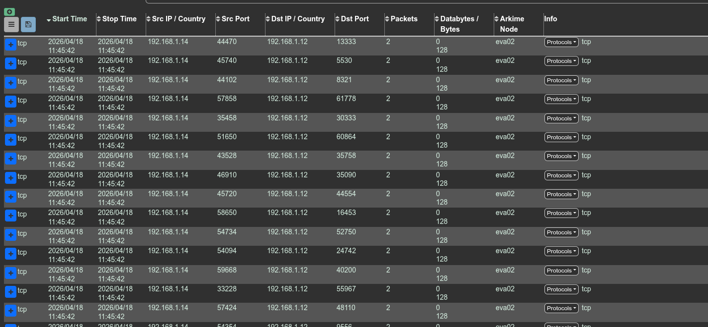
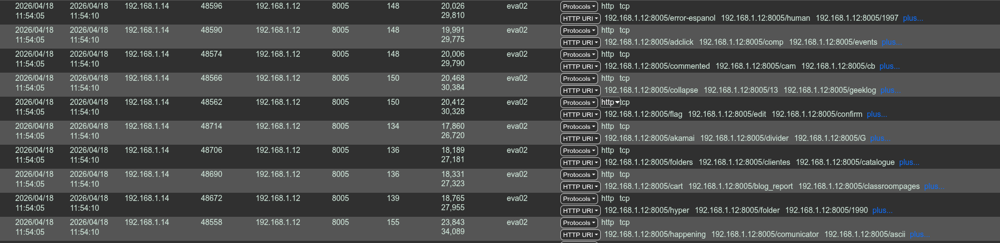
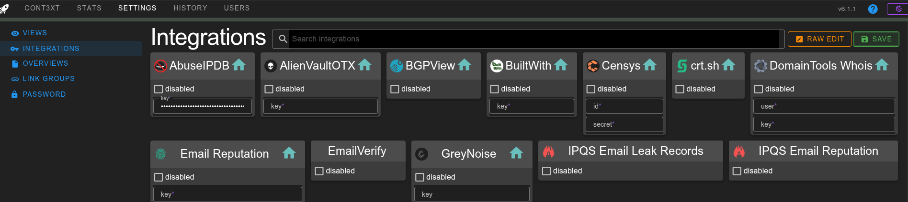
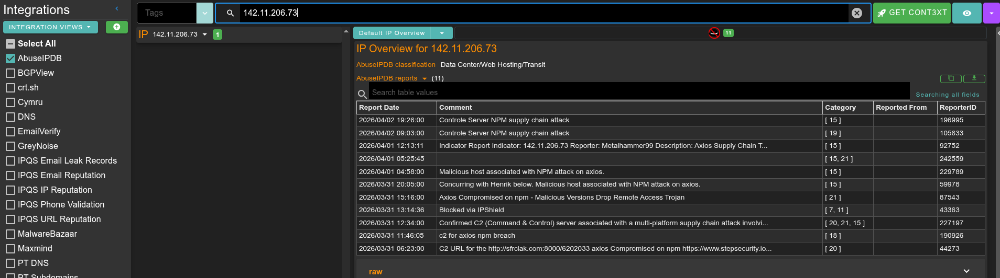
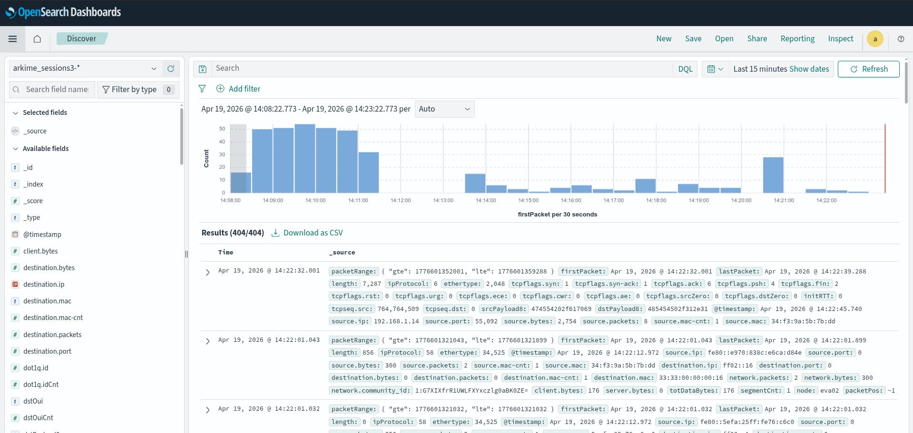
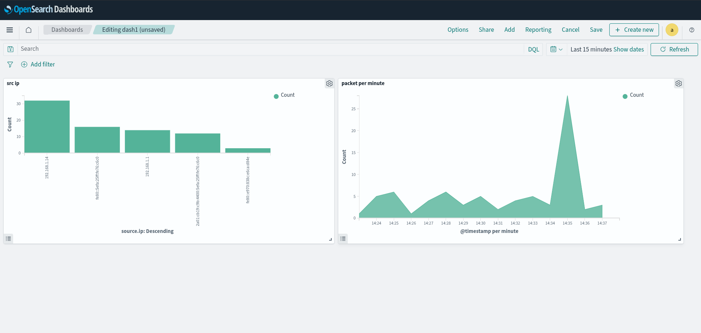

# Labs : OpenSearch + Arkime + OpenSearch Dashboards

This article is not really a course or a tutorial but the walkthrough of setting up a lab which allowed experimentation with the previously mentioned technology.

*In 2021, the company Elastic (which owns Kibana and Elasticsearch) stopped publishing these softwares under an Open Source and free license. The community then took the last truly "free" version and decided to continue developing it independently. Elasticsearch became OpenSearch. Kibana became OpenSearch Dashboards.*

## OpenSearch
OpenSearch is a protocol allowing indexing and searching in a large amount of data.

## Arkime
Composed of 3 modules:

- capture : sniff the packets
- viewer : web ui for viewing packages
- cont3xt : allows packet enrichment with a system for ingesting APIs (for correlation and analysis)

Arkime stores this data in Opensearch.

## OpenSearch Dashboards
Used to create dashboards and visualize data.

## Our lab :
```
arkimecapture + arkimecont3xt <----> OpenSearch <----> OpenSearch DashBoards
```

#### Install opensearch :
```
sudo apt update
sudo apt install -y wget curl
sudo wget https://artifacts.opensearch.org/releases/bundle/opensearch/2.13.0/opensearch-2.13.0-linux-x64.deb

sudo OPENSEARCH_INITIAL_ADMIN_PASSWORD="DaPazzwordtochange" \
apt install -y ./opensearch-2.13.0-linux-x64.deb

sudo systemctl daemon-reload # not specified in the documentation, but it doesn't work otherwise
sudo systemctl enable opensearch.service
sudo systemctl start opensearch.service
```

```
curl -k --user "admin:$OPENSEARCH_INITIAL_ADMIN_PASSWORD" https://localhost:9200/_cat/health

should return : 1681901234 12:33:54 opensearch-cluster green 1 1 0 0 0 0 0 0 - 100.0%
```

### Install Arkime
```
wget https://github.com/arkime/arkime/releases/download/v6.1.1/arkime_6.1.1-1.ubuntu2404_amd64.deb

sudo apt install ./arkime_6.1.1-1.ubuntu2404_amd64.deb
```

Init opensearch for Arkime :
```
/opt/arkime/db/db.pl --esuser admin https://localhost:9200 init --ism

/opt/arkime/db/db.pl --esuser admin https://localhost:9200 ism 1d 30d

1d : One index (data grouping) is created per day
30d : Data is save for 30 days
```

Configuration script :
```
/opt/arkime/bin/Configure
-> specifying the opensearch address (localhost), and the password
```

Create a user :
```
/opt/arkime/bin/arkime_add_user.sh admin "Admin User" changeme --admin
```

```
systemctl enable --now arkimecapture
systemctl enable --now arkimeviewer
```

#### Troubleshooting
In this configuration the arkimecapture service was not working. So I launched it manually to see the error and it was the absence of the oui.txt file (allowing MACs to be linked to the machine manufacturer).
```
sudo /opt/arkime/bin/capture -c /opt/arkime/etc/config.ini

FATAL CONFIG ERROR - Couldn't stat oui file '/opt/arkime/etc/oui.txt' with error 'No such file or directory' - FIX by running /opt/arkime/bin/arkime_update_geo.sh OR updating the ouiFile setting
```

So I corrected the problem by running the Geo and OUI file update script:
```
sudo /opt/arkime/bin/arkime_update_geo.sh
```

Once connected to the console we change the admin password.

#### Nmap test


#### Fuzzing test



### Setup Cont3xt
```
sudo /opt/arkime/bin/Configure --cont3xt

systemctl enable --now arkimecont3xt
```

A new interface is available on port 3218. Now we will configure the abuseIPDB API key to demonstrate how it works.

After creating an account on AbuseIPDB, Settings > AbuseIPDB > key.



Once this is done, if we are looking for information on an IP (for example the C2 used by the rat that infected Axios 142[.]11[.]206[.]73), we can easily merge information from AbuseIPDB but also from other providers once configured:



### Create Kibana dashboard

I had no more space on my vm. So I launch opensearchDashboard on my host machine:

```bash
docker run -d -p 5601:5601 -e 'OPENSEARCH_HOSTS=["https://192.168.1.12:9200"]' -e "OPENSEARCH_USERNAME=admin" -e "OPENSEARCH_PASSWORD=DaPazzwordtochange" -e "SERVER_HOST=0.0.0.0" opensearchproject/opensearch-dashboards:latest
```

The problem is that currently opensearch only listens locally so I had to add these lines in the opensearch configuration:
```
sudo nano /etc/opensearch/opensearch.yml
```
```
# allow connections from other machines than localhost
network.host: 0.0.0.0

# force single node mode
discovery.type: single-node
```

To check that our data is accessible, in the discover on selection menu this data source:
```
arkime_sessions3-*
```
(To see all the data sources go to Index Management)




We can then create our dashboard (difficult to explain how in an article because it is mainly point and click, the best is to watch a visual tutorial):

